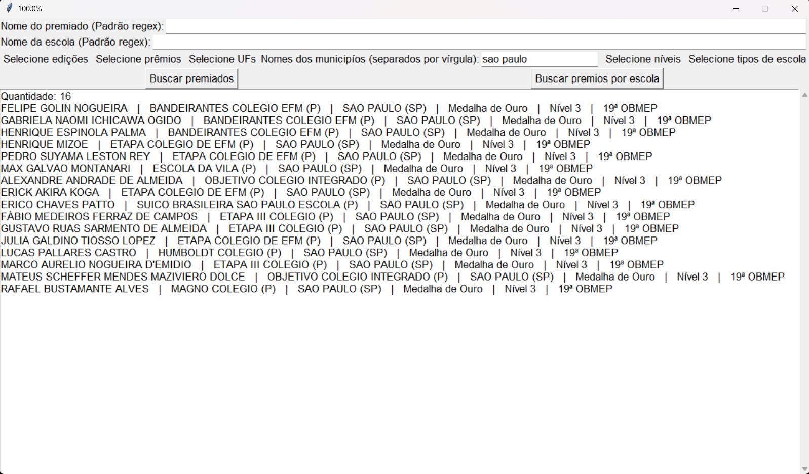

<<<<<<< HEAD
# Consulta de premiados da OBMEP

Um programa em Python para consultar, filtrar e analisar os premiados na Olimpíada Brasileira de Matemática das Escolas Públicas (OBMEP).

## Funcionalidades

- Baixar todas as tabelas das listagens dos premiados como CSV utilizando urllib e Pandas.


Monitoramento e divisão de tabelas baixadas.

- Pesquisar e filtrar premiações por nome do premiado, nome e tipo da escola, edição, prêmio, UF, município e nível.


Premiações cujo nome do aluno atende ao padrão regex `^gabriel.*bruno`.


Premiações filtradas para serem apenas aquelas da 19ª OBMEP, com prêmio sendo uma medalha de ouro, na cidade de São Paulo, no nível 3 e de escolas particulares.

- Listar, em ordem, a quantidade de premiações por escola com os mesmos filtros.


Escolas com mais medalhas de ouro da Região Sudeste.

## Instalação

1. Tenha instalado Python 3.10.0 ou mais recente

2. Clone o repositório:
```
git clone https://github.com/GabrielVBruno/consulta-premiados-obmep.git
cd consulta-premiados-obmep
```

3. Instale as dependências (`pandas`, `tqdm` e `unidecode`):
```
pip install -r requirements.txt
```

## Uso

1. Digite o comando para inicializar o `main.py`:
```
python src/main.py
```

2. Escolha uma das opção para baixar as tabelas ou continue caso já tenha baixado.


3. Uma nova janela de interface aparecerá. 
   - Nela é possível filtrar premiações digitando o nome do premiado e/ou da escola a partir de um padrão regex, além de selecionar edições, prêmios, UFs, municípios, níveis e tipo de escola.
   - Após preencher os filtros, escolha, ao pressionar um dos os dois botões, entre buscar premiados ou escolas com tais critérios.

